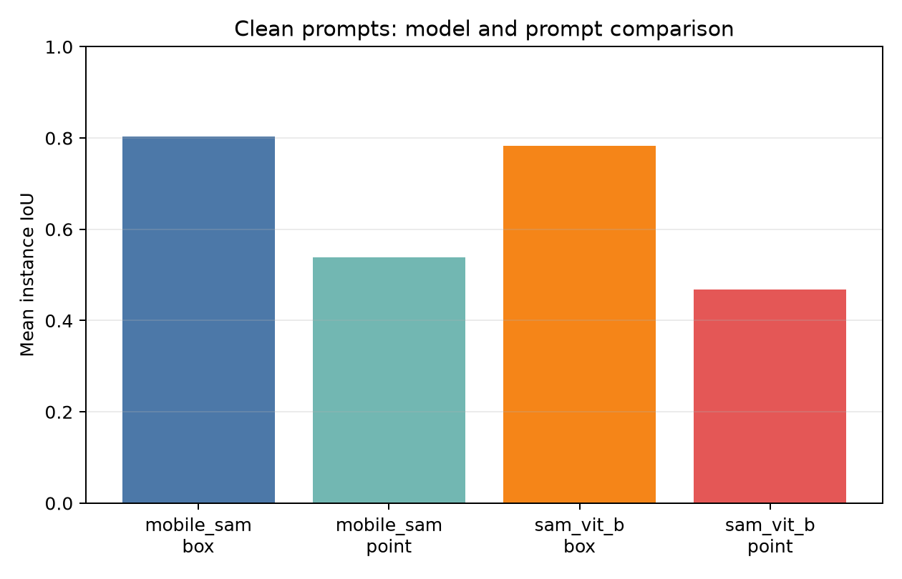
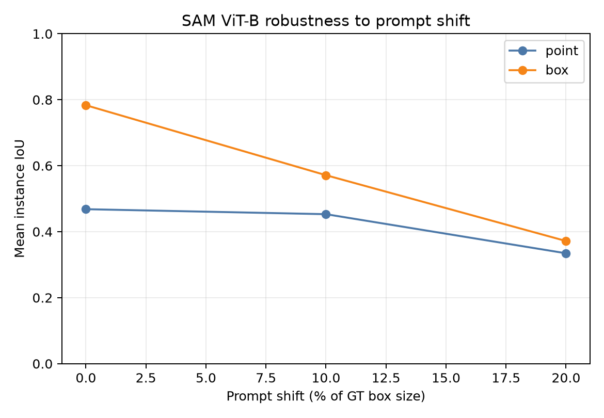

# Slide 3: Key Results

## Baseline comparison and prompt sensitivity

### On-slide findings

- **Setup 1:** On clean prompts, MobileSAM exceeded SAM ViT-B on this sample: box **0.803 vs 0.783**, point **0.538 vs 0.468** mean IoU.
- **Setup 2:** For SAM ViT-B, clean box exceeded point by **+0.315 paired mean IoU** (43/50 instances).
- **Setup 3:** At 20% shift, SAM box fell **0.783 → 0.372** and point **0.468 → 0.335** mean IoU.

> **Evaluation scope:** 50 fixed COCO val2017 instances, three shifted trials per noise level, seed 2026. All 800 scheduled model-prompt runs have `status=ok`.

## Suggested slide layout

- Place the title at the top.
- Use the clean comparison and robustness figures side by side.
- Keep only the three one-line findings beneath or beside the figures.
- Keep the evaluation scope as a small footer.

## Number traceability

| Slide value | CSV source | Row or calculation |
|---|---|---|
| 0.803 MobileSAM clean box IoU | `results/metrics/summary_metrics.csv` | `mobile_sam`, `box`, `noise_level=0.0`, `mean_iou` |
| 0.538 MobileSAM clean point IoU | `results/metrics/summary_metrics.csv` | `mobile_sam`, `point`, `noise_level=0.0`, `mean_iou` |
| 0.783 clean box mean IoU | `results/metrics/summary_metrics.csv` | `sam_vit_b`, `box`, `noise_level=0.0`, `mean_iou` |
| 0.468 clean point mean IoU | `results/metrics/summary_metrics.csv` | `sam_vit_b`, `point`, `noise_level=0.0`, `mean_iou` |
| +0.315 paired box-minus-point | `results/metrics/paired_summary.csv` | `setup2_box_minus_point`, `mean_difference` |
| 43 of 50 pairs | `results/metrics/paired_summary.csv` | `setup2_box_minus_point`, `n_positive` and `n_pairs` |
| 0.372 box IoU at 20% | `results/metrics/summary_metrics.csv` | `sam_vit_b`, `box`, `noise_level=0.2`, `mean_iou` |
| 0.335 point IoU at 20% | `results/metrics/summary_metrics.csv` | `sam_vit_b`, `point`, `noise_level=0.2`, `mean_iou` |
| -0.412 box change | `results/metrics/paired_summary.csv` | `setup3_noisy_minus_clean`, `box`, `noise_level=0.2` |
| -0.134 point change | `results/metrics/paired_summary.csv` | `setup3_noisy_minus_clean`, `point`, `noise_level=0.2` |
| 73.3% point inside GT | `results/metrics/summary_metrics.csv` | `sam_vit_b`, `point`, `noise_level=0.2`, `point_inside_gt_rate` |
| 0.498 noisy-box overlap | `results/metrics/summary_metrics.csv` | `sam_vit_b`, `box`, `noise_level=0.2`, `mean_box_iou_gt` |
| 800 successful runs | `results/metrics/per_run_with_metrics.csv` | 800 rows with `metric_valid=True` |

Speaker notes

Both models received the same 100 clean prompts. MobileSAM's small numerical lead on this fixed 50-instance sample is descriptive, not a general superiority claim. For SAM ViT-B, the clean box beat the clean point on 43 of 50 paired instances. Under a 20% shift, both prompt types lost mean IoU; 73.3% of shifted points still lay inside GT and shifted boxes had 0.498 mean overlap with the clean box. Each noisy condition has three trials per instance, not 150 independent images. These results use simulated prompts, not a real user study. The shared-run mask bundle arrived after the tables were generated; its 800 mask IoUs were subsequently verified against GT on 2026-10-06. The matching masks are now downloadable as `results.zip` from the repository.

## Data provenance

All values come from the 800-row experiment log identified in [`results/metrics/SOURCE.md`](../results/metrics/SOURCE.md). No placeholder or manually invented result is included.
